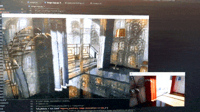
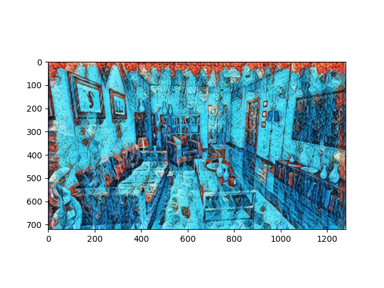

# Real time style transfer UE4

the correct file to run is `rt-style.py`

make sure to run an Unreal OpenCV exec before executing the python file 

made to run on a 2070 Super, lower end GPUs will be slower/crash

## Setup
to activate venv run

`.\env\Scripts\activate`

to deactivate run

`deactivate`

make sure to have cuda 10.1 installed and cudnn 7

change screencap resolution in unrealcv.ini

change game resolution in GameUserSettings.ini

## Architecture
the program architecture is simple:

start the model

connect to unreal

a while loop
    get ue4 frame
    stylize
    display

The model used is https://tfhub.dev/google/magenta/arbitrary-image-stylization-v1-256/2 

## More

@LoeizD https://bergamot.digital

with help from @shramee https://leastimperfect.com/
